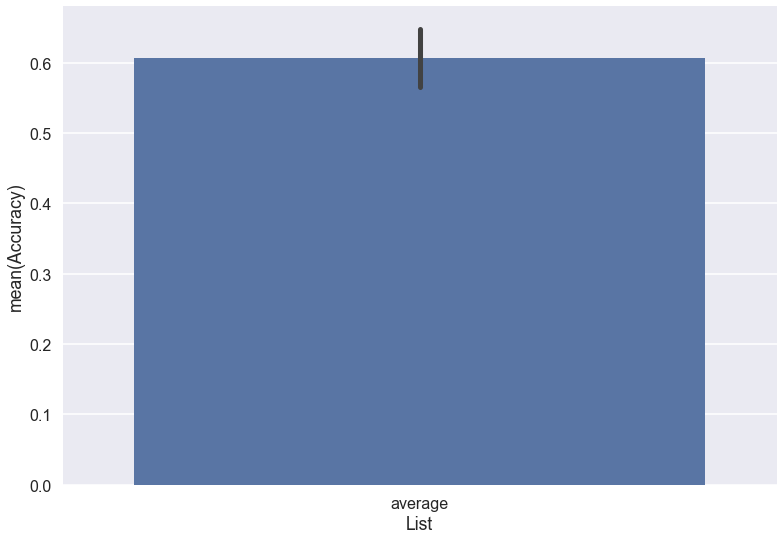
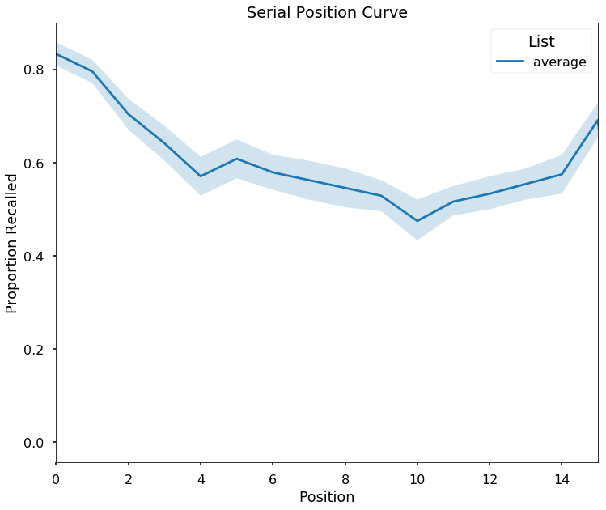
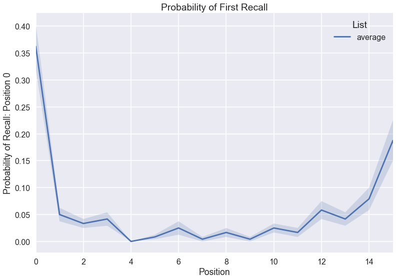
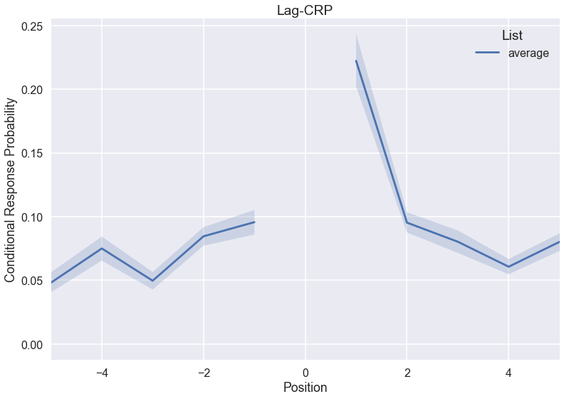
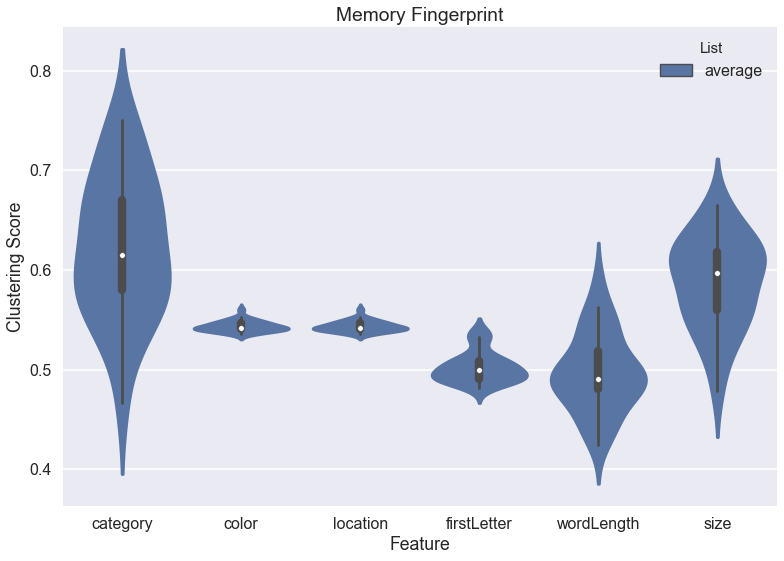

<!-- 

 -->

<h2>Try it!</h2>

Click the badge to launch a binder instance with example uses:

[](http://mybinder.org:/repo/contextlab/quail-example-notebooks)

or

Check the [repo](https://github.com/ContextLab/quail-example-notebooks) of Jupyter notebooks.

<h2>Installation</h2>

`pip install quail`

or

To install from this repo:

`git clone https://github.com/ContextLab/quail.git`

Then, navigate to the folder and type:

`pip install -e .`

(this assumes you have [pip](https://pip.pypa.io/en/stable/installing/) installed on your system)

<h2>Requirements</h2>

+ python 2.7, 3.4+
+ pandas>=0.18.0
+ seaborn>=0.7.1
+ matplotlib>=1.5.1
+ scipy>=0.17.1
+ numpy>=1.10.4
+ future
+ pytest (for development)

If installing from github (instead of pip), you must also install the requirements:
`pip install -r requirements.txt`

<h2>Documentation</h2>

Check out our readthedocs: [here](http://cdl-quail.readthedocs.io/en/latest/).

<!-- <h2>Citing</h2>

We wrote a paper about quail, which you can read [here](https://arxiv.org/abs/1701.08290). We also have a repo with example notebooks from the paper [here](https://github.com/ContextLab/quail-example-notebooks).

Please cite as:

`Heusser AC, Ziman K, Owen LLW, Manning JR (2017) quail: A Python toolbox for visualizing and manipulating high-dimensional data.  arXiv: 1701.08290`

Here is a bibtex formatted reference:

```
@ARTICLE {,
    author  = "A C Heusser and K Ziman and L L W Owen and J R Manning",
    title   = "quail: A Python toolbox for visualizing and manipulating high-dimensional data",
    journal = "arXiv",
    year    = "2017",
    volume  = "1701",
    number  = "08290",
    month   = "jan"
}
``` -->

<h2>Contributing</h2>
(some text borrowed from Matplotlib contributing [guide](http://matplotlib.org/devdocs/devel/contributing.html))

<h3>Submitting a bug report</h3>
If you are reporting a bug, please do your best to include the following -

1. A short, top-level summary of the bug. In most cases, this should be 1-2 sentences.
2. A short, self-contained code snippet to reproduce the bug, ideally allowing a simple copy and paste to reproduce. Please do your best to reduce the code snippet to the minimum required.
3. The actual outcome of the code snippet
4. The expected outcome of the code snippet

<h3>Contributing code</h3>

The preferred way to contribute to quail is to fork the main repository on GitHub, then submit a pull request.

+ If your pull request addresses an issue, please use the title to describe the issue and mention the issue number in the pull request description to ensure a link is created to the original issue.

+ All public methods should be documented in the README.

+ Each high-level plotting function should have a simple example in the examples folder. This should be as simple as possible to demonstrate the method.

+ Changes (both new features and bugfixes) should be tested using `pytest`.  Add tests for your new feature to the `tests/` repo folder.

<h2>Testing</h2>

[](https://travis-ci.com/ContextLab/hypertools)


To test quail, install pytest (`pip install pytest`) and run `pytest` in the quail folder

<h2>Examples</h2>
See [here](http://cdl-quail.readthedocs.io/en/latest/auto_examples/index.html) for more examples.

<h2>Create an `egg`!</h2>

Eggs are the fundamental data structure in `quail`.  They are comprised of lists of presented words, lists of recalled words, and a few other optional components.

```
import quail

# presented words
presented_words = [['cat', 'bat', 'hat', 'goat'],['zoo', 'animal', 'zebra', 'horse']]

# recalled words
recalled_words = [['bat', 'cat', 'goat', 'hat'],['animal', 'horse', 'zoo']]

# create egg
egg = quail.Egg(pres=presented_words, rec=recalled_words)

```

<h2>Analyze some data</h2>

```
#load data
egg = quail.load_example_data()

#analysis
analyzed_data = quail.analyze(egg, analysis='accuracy', listgroup=['average']*16)
```

<h2>Plot Accuracy</h2>

```
analyzed_data = quail.analyze(egg, analysis='accuracy', listgroup=['average']*16)
ax = quail.plot(analyzed_data, title='Recall Accuracy')
```


<h2>Plot Serial Position Curve</h2>

```
analyzed_data = quail.analyze(egg, analysis='spc', listgroup=['average']*16)
ax = quail.plot(analyzed_data, title='Serial Position Curve')
```


<h2>Plot Probability of First Recall</h2>

```
analyzed_data = quail.analyze(egg, analysis='pfr', listgroup=['average']*16)
ax = quail.plot(analyzed_data, title='Probability of First Recall')
```


<h2>Plot Lag-CRP</h2>

```
analyzed_data = quail.analyze(egg, analysis='lagcrp', listgroup=['average']*16)
ax = quail.plot(analyzed_data, title='Lag-CRP')
```


<h2>Plot Memory Fingerprint</h2>

```
analyzed_data = quail.analyze(egg, analysis='fingerprint', listgroup=['average']*16)
ax = quail.plot(analyzed_data, title='Memory Fingerprint')
```

