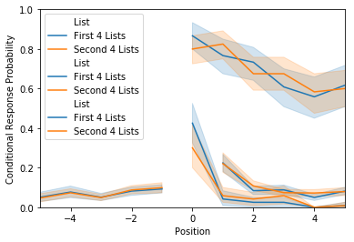

Advanced plotting
=================

This tutorial will go over more advanced plotting functionality. Before
reading this, you should take a look at the basic analysis and plotting
tutorial. First, we’ll load in some example data. This dataset is an
``egg`` comprised of 30 subjects, who each performed 8 study/test blocks
of 16 words each.

.. code:: ipython3

    import quail
    %matplotlib inline
    egg = quail.load_example_data()

.. code:: ipython3

    import warnings
    warnings.filterwarnings('ignore')

.. code:: ipython3

    import warnings
    warnings.filterwarnings('ignore')

Accuracy
--------

.. code:: ipython3

    accuracy = egg.analyze('accuracy')
    accuracy.get_data().head()

.. raw:: html

    

    
    <table border="1" class="dataframe">
      <thead>
        <tr style="text-align: right;">
          <th></th>
          <th></th>
          <th>0</th>
        </tr>
        <tr>
          <th>Subject</th>
          <th>List</th>
          <th></th>
        </tr>
      </thead>
      <tbody>
        <tr>
          <th rowspan="5" valign="top">0</th>
          <th>0</th>
          <td>0.5000</td>
        </tr>
        <tr>
          <th>1</th>
          <td>0.5625</td>
        </tr>
        <tr>
          <th>2</th>
          <td>0.1250</td>
        </tr>
        <tr>
          <th>3</th>
          <td>0.5625</td>
        </tr>
        <tr>
          <th>4</th>
          <td>0.3125</td>
        </tr>
      </tbody>
    </table>
    

By default, the ``analyze`` function will perform an analysis on each
list separately, so when you plot the result, it will plot a separate
bar for each list, averaged over all subjects:

.. code:: ipython3

    ax = accuracy.plot()

.. image:: advanced_plotting_files/advanced_plotting_7_0.png

We can plot the accuracy for each subject by setting
``plot_type='subject'``, and we can change the name of the subject
grouping variable by setting the ``subjname`` kwarg:

.. code:: ipython3

    ax = accuracy.plot(plot_type='subject', subjname='Subject Number')

Furthermore, we can add a title using the ``title`` kwarg, and change
the y axis limits using ``ylim``:

.. code:: ipython3

    ax = accuracy.plot(plot_type='subject', subjname='Subject Number',
                    title='Accuracy by Subject', ylim=[0,1])

.. image:: advanced_plotting_files/advanced_plotting_11_0.png

We can also group the subjects. This is useful in cases where you might
want to compare analysis results across multiple experiments. To do this
we will reanalyze the data, averaging over lists within a subject, and
then use the ``subjgroup`` kwarg to group the subjects into two sets:

.. code:: ipython3

    accuracy = egg.analyze('accuracy', listgroup=['average']*8)
    accuracy.get_data().head()

.. raw:: html

    

    
    <table border="1" class="dataframe">
      <thead>
        <tr style="text-align: right;">
          <th></th>
          <th></th>
          <th>0</th>
        </tr>
        <tr>
          <th>Subject</th>
          <th>List</th>
          <th></th>
        </tr>
      </thead>
      <tbody>
        <tr>
          <th>0</th>
          <th>average</th>
          <td>0.367188</td>
        </tr>
        <tr>
          <th>1</th>
          <th>average</th>
          <td>0.601562</td>
        </tr>
        <tr>
          <th>2</th>
          <th>average</th>
          <td>0.742188</td>
        </tr>
        <tr>
          <th>3</th>
          <th>average</th>
          <td>0.546875</td>
        </tr>
        <tr>
          <th>4</th>
          <th>average</th>
          <td>0.867188</td>
        </tr>
      </tbody>
    </table>
    

.. code:: ipython3

    ax = accuracy.plot(subjgroup=['Experiment 1']*15+['Experiment 2']*15)

.. image:: advanced_plotting_files/advanced_plotting_14_0.png

Oops, what happened there? By default, the ``plot`` function looks to
the List column of the df to group the data. To group according to
subject group, we must tell the plot function to plot by ``subjgroup``.
This can be achieved by setting ``plot_type='subject'``:

.. code:: ipython3

    ax = accuracy.plot(subjgroup=['Experiment 1']*15+['Experiment 2']*15, plot_type='subject')

.. image:: advanced_plotting_files/advanced_plotting_16_0.png

If you also have a list grouping (such as first 4 lists / second 4
lists), you can plot the interaction by setting ``plot_type='split'``.
This will create a plot with respect to both the ``subjgroup`` and
``listgroup``:

.. code:: ipython3

    accuracy = egg.analyze('accuracy', listgroup=['First 4 Lists']*4+['Second 4 Lists']*4)
    ax = accuracy.plot(subjgroup=['Experiment 1']*15+['Experiment 2']*15, plot_type='split')

.. image:: advanced_plotting_files/advanced_plotting_18_0.png

Memory fingerprints
-------------------

The Memory Fingerprint plotting works exactly the same as the the
accuracy plots, with the except that ``plot_type='split'`` only works
for the accuracy plots, and the default ``plot_style`` is a violinplot,
instead of a barplot.

.. code:: ipython3

    fingerprint = egg.analyze('fingerprint', listgroup=['First 4 Lists']*4+['Second 4 Lists']*4)
    ax = fingerprint.plot(subjgroup=['Experiment 1']*15+['Experiment 2']*15, plot_type='subject')
    ax = fingerprint.plot(subjgroup=['Experiment 1']*15+['Experiment 2']*15, plot_type='list')

.. image:: advanced_plotting_files/advanced_plotting_21_0.png

Other analyses
--------------

Like the plots above, spc, pfr and lagcrp plots can all be plotted
according to ``listgroup`` or ``subjgroup`` by setting the ``plot_type``
kwarg.

Plot by list grouping
~~~~~~~~~~~~~~~~~~~~~

.. code:: ipython3

    listgroup = ['First 4 Lists']*4+['Second 4 Lists']*4
    plot_type = 'list'
    
    spc = egg.analyze('spc', listgroup=listgroup)
    import matplotlib.pyplot as plt
    plt.figure()
    import matplotlib.pyplot as plt
    plt.figure()
    ax = spc.plot(plot_type=plot_type, ylim=[0, 1])
    
    pfr = egg.analyze('pfr', listgroup=listgroup)
    import matplotlib.pyplot as plt
    plt.figure()
    import matplotlib.pyplot as plt
    plt.figure()
    ax = pfr.plot(plot_type=plot_type)
    
    lagcrp = egg.analyze('lagcrp', listgroup=listgroup)
    import matplotlib.pyplot as plt
    plt.figure()
    import matplotlib.pyplot as plt
    plt.figure()
    ax = lagcrp.plot(plot_type=plot_type)

.. parsed-literal::

    <Figure size 640x480 with 0 Axes>

.. image:: advanced_plotting_files/advanced_plotting_24_1.png

.. parsed-literal::

    <Figure size 640x480 with 0 Axes>

.. image:: advanced_plotting_files/advanced_plotting_24_3.png

.. parsed-literal::

    <Figure size 640x480 with 0 Axes>

.. image:: advanced_plotting_files/advanced_plotting_24_5.png

Plot by subject grouping
~~~~~~~~~~~~~~~~~~~~~~~~

.. code:: ipython3

    listgroup=['average']*8
    subjgroup = ['Experiment 1']*15+['Experiment 2']*15
    plot_type = 'subject'
    
    spc = egg.analyze('spc', listgroup=listgroup)
    import matplotlib.pyplot as plt
    plt.figure()
    import matplotlib.pyplot as plt
    plt.figure()
    ax = spc.plot(subjgroup=subjgroup, plot_type=plot_type, ylim=[0,1])
    
    pfr = egg.analyze('pfr', listgroup=listgroup)
    import matplotlib.pyplot as plt
    plt.figure()
    import matplotlib.pyplot as plt
    plt.figure()
    ax = pfr.plot(subjgroup=subjgroup, plot_type=plot_type)
    
    lagcrp = egg.analyze('lagcrp', listgroup=listgroup)
    import matplotlib.pyplot as plt
    plt.figure()
    import matplotlib.pyplot as plt
    plt.figure()
    ax = lagcrp.plot(subjgroup=subjgroup, plot_type=plot_type)

.. parsed-literal::

    <Figure size 640x480 with 0 Axes>

.. parsed-literal::

    <Figure size 640x480 with 0 Axes>

.. image:: advanced_plotting_files/advanced_plotting_26_3.png

.. parsed-literal::

    <Figure size 640x480 with 0 Axes>

.. image:: advanced_plotting_files/advanced_plotting_26_5.png

