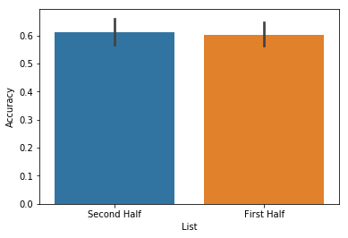
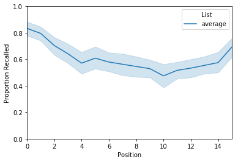
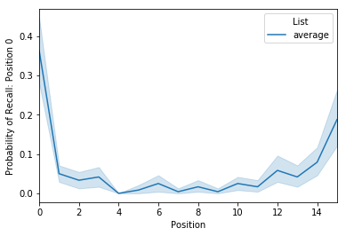
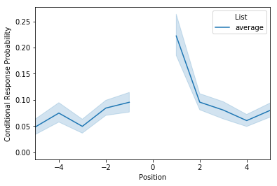
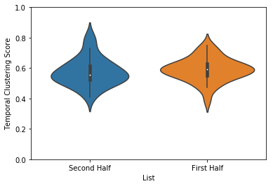

Basic analyzing and plotting
============================

This tutorial will go over the basics of analyzing ``eggs``, the primary
data structure used in ``quail``. To learn about how an egg is set up,
see the egg tutorial.

An egg is made up of (at minimum) the stimuli presented to a subject and
the stimuli recalled by the subject. With these, two components we can
perform a number of analyses:

1. **Recall Accuracy** - the proportion of stimuli presented that were
   later recalled
2. **Serial Position Curve** - recall accuracy as a function of the
   encoding position of the stimulus
3. **Probability of First Recall** - the probability that a stimulus
   will be recalled first as a function of its encoding position
4. **Lag-CRP** - given the recall of word n, the probability of
   recalling stimuli at neighboring positions (n+/-1, 2, 3 etc).
5. **Temporal Clustering** - a measure of recall clustering by temporal
   proximity during encoding

If we have a set of features for the stimuli, we can also compute a
**Memory Fingerprint**, which is an estimate of how a subject clusters
their recall responses with respect to features of a stimulus (see the
fingerprint tutorial for more on this).

Let’s get to analyzing some ``eggs``. First, we’ll load in some example
data:

.. code:: ipython3

    import quail
    %matplotlib inline
    
    egg = quail.load_example_data()

.. parsed-literal::

    /usr/local/lib/python3.6/site-packages/pydub/utils.py:165: RuntimeWarning: Couldn't find ffmpeg or avconv - defaulting to ffmpeg, but may not work
      warn("Couldn't find ffmpeg or avconv - defaulting to ffmpeg, but may not work", RuntimeWarning)

This dataset is comprised of 30 subjects, who each performed 8
study/test blocks of 16 words each. Here are some of the presented
words:

.. code:: ipython3

    egg.get_pres_items().head()

.. raw:: html

    

    
    <table border="1" class="dataframe">
      <thead>
        <tr style="text-align: right;">
          <th></th>
          <th></th>
          <th>0</th>
          <th>1</th>
          <th>2</th>
          <th>3</th>
          <th>4</th>
          <th>5</th>
          <th>6</th>
          <th>7</th>
          <th>8</th>
          <th>9</th>
          <th>10</th>
          <th>11</th>
          <th>12</th>
          <th>13</th>
          <th>14</th>
          <th>15</th>
        </tr>
        <tr>
          <th>Subject</th>
          <th>List</th>
          <th></th>
          <th></th>
          <th></th>
          <th></th>
          <th></th>
          <th></th>
          <th></th>
          <th></th>
          <th></th>
          <th></th>
          <th></th>
          <th></th>
          <th></th>
          <th></th>
          <th></th>
          <th></th>
        </tr>
      </thead>
      <tbody>
        <tr>
          <th rowspan="5" valign="top">0</th>
          <th>0</th>
          <td>b'BROCCOLI'</td>
          <td>b'CAULIFLOWER'</td>
          <td>b'ONION'</td>
          <td>b'PICKLE'</td>
          <td>b'STRAINER'</td>
          <td>b'SAUCER'</td>
          <td>b'DISH'</td>
          <td>b'BUTTERCUP'</td>
          <td>b'GRIDDLE'</td>
          <td>b'CARPET'</td>
          <td>b'FLOOR'</td>
          <td>b'FOUNDATION'</td>
          <td>b'ELEVATOR'</td>
          <td>b'AZALEA'</td>
          <td>b'DAHLIA'</td>
          <td>b'LOG'</td>
        </tr>
        <tr>
          <th>1</th>
          <td>b'POTATO'</td>
          <td>b'CHIMNEY'</td>
          <td>b'GERMANY'</td>
          <td>b'BLOUSE'</td>
          <td>b'EGYPT'</td>
          <td>b'LOBBY'</td>
          <td>b'JACKET'</td>
          <td>b'ARTICHOKE'</td>
          <td>b'CLOSET'</td>
          <td>b'SUIT'</td>
          <td>b'CUBA'</td>
          <td>b'GARLIC'</td>
          <td>b'CAMISOLE'</td>
          <td>b'SPINACH'</td>
          <td>b'IRAN'</td>
          <td>b'FURNACE'</td>
        </tr>
        <tr>
          <th>2</th>
          <td>b'OVEN'</td>
          <td>b'TUBA'</td>
          <td>b'MONTREAL'</td>
          <td>b'MUG'</td>
          <td>b'HIP'</td>
          <td>b'BROILER'</td>
          <td>b'PICCOLO'</td>
          <td>b'ARMS'</td>
          <td>b'DALLAS'</td>
          <td>b'ROME'</td>
          <td>b'TRUMPET'</td>
          <td>b'PELVIS'</td>
          <td>b'THERMOMETER'</td>
          <td>b'TAMBOURINE'</td>
          <td>b'PARIS'</td>
          <td>b'STOMACH'</td>
        </tr>
        <tr>
          <th>3</th>
          <td>b'MOOSE'</td>
          <td>b'MICHIGAN'</td>
          <td>b'CLEMENTINE'</td>
          <td>b'ANTELOPE'</td>
          <td>b'MONKEY'</td>
          <td>b'RIB'</td>
          <td>b'RACOON'</td>
          <td>b'FLORIDA'</td>
          <td>b'TONGUE'</td>
          <td>b'POMEGRANATE'</td>
          <td>b'PEAR'</td>
          <td>b'IOWA'</td>
          <td>b'PANCREAS'</td>
          <td>b'KANSAS'</td>
          <td>b'LEMON'</td>
          <td>b'TOOTH'</td>
        </tr>
        <tr>
          <th>4</th>
          <td>b'KITCHEN'</td>
          <td>b'ROSE'</td>
          <td>b'DOG'</td>
          <td>b'CARNATION'</td>
          <td>b'BARN'</td>
          <td>b'DONKEY'</td>
          <td>b'TIGER'</td>
          <td>b'EAR'</td>
          <td>b'FACE'</td>
          <td>b'GAZEBO'</td>
          <td>b'HEART'</td>
          <td>b'PETUNIA'</td>
          <td>b'HIPPOPOTAMUS'</td>
          <td>b'ALCOVE'</td>
          <td>b'TULIP'</td>
          <td>b'KNUCKLE'</td>
        </tr>
      </tbody>
    </table>
    

and some of the recalled words:

.. code:: ipython3

    egg.get_rec_items().head()

.. raw:: html

    

    
    <table border="1" class="dataframe">
      <thead>
        <tr style="text-align: right;">
          <th></th>
          <th></th>
          <th>0</th>
          <th>1</th>
          <th>2</th>
          <th>3</th>
          <th>4</th>
          <th>5</th>
          <th>6</th>
          <th>7</th>
          <th>8</th>
          <th>9</th>
          <th>...</th>
          <th>12</th>
          <th>13</th>
          <th>14</th>
          <th>15</th>
          <th>16</th>
          <th>17</th>
          <th>18</th>
          <th>19</th>
          <th>20</th>
          <th>21</th>
        </tr>
        <tr>
          <th>Subject</th>
          <th>List</th>
          <th></th>
          <th></th>
          <th></th>
          <th></th>
          <th></th>
          <th></th>
          <th></th>
          <th></th>
          <th></th>
          <th></th>
          <th></th>
          <th></th>
          <th></th>
          <th></th>
          <th></th>
          <th></th>
          <th></th>
          <th></th>
          <th></th>
          <th></th>
          <th></th>
        </tr>
      </thead>
      <tbody>
        <tr>
          <th rowspan="5" valign="top">0</th>
          <th>0</th>
          <td>b'BROCCOLI'</td>
          <td>b'CAULIFLOWER'</td>
          <td>b'ONION'</td>
          <td>b'DISH'</td>
          <td>b'GRIDDLE'</td>
          <td>b'DAHLIA'</td>
          <td>b'SAUCER'</td>
          <td>b'AZALEA'</td>
          <td>None</td>
          <td>None</td>
          <td>...</td>
          <td>None</td>
          <td>None</td>
          <td>NaN</td>
          <td>NaN</td>
          <td>NaN</td>
          <td>NaN</td>
          <td>NaN</td>
          <td>NaN</td>
          <td>NaN</td>
          <td>NaN</td>
        </tr>
        <tr>
          <th>1</th>
          <td>b'FURNACE'</td>
          <td>b'CHIMNEY'</td>
          <td>b'CUBA'</td>
          <td>b'GERMANY'</td>
          <td>b'ARTICHOKE'</td>
          <td>b'SPINACH'</td>
          <td>b'POTATO'</td>
          <td>b'SUIT'</td>
          <td>b'CLOSET'</td>
          <td>b'CHIMNEY'</td>
          <td>...</td>
          <td>None</td>
          <td>None</td>
          <td>NaN</td>
          <td>NaN</td>
          <td>NaN</td>
          <td>NaN</td>
          <td>NaN</td>
          <td>NaN</td>
          <td>NaN</td>
          <td>NaN</td>
        </tr>
        <tr>
          <th>2</th>
          <td>b'MAINE'</td>
          <td>b'ARMS'</td>
          <td>b'PARIS'</td>
          <td>None</td>
          <td>None</td>
          <td>None</td>
          <td>None</td>
          <td>None</td>
          <td>None</td>
          <td>None</td>
          <td>...</td>
          <td>None</td>
          <td>None</td>
          <td>NaN</td>
          <td>NaN</td>
          <td>NaN</td>
          <td>NaN</td>
          <td>NaN</td>
          <td>NaN</td>
          <td>NaN</td>
          <td>NaN</td>
        </tr>
        <tr>
          <th>3</th>
          <td>b'IS'</td>
          <td>b'RIB'</td>
          <td>b'PANCREAS'</td>
          <td>b'CLEMENTINE'</td>
          <td>b'LEMON'</td>
          <td>b'IOWA'</td>
          <td>b'FLORIDA'</td>
          <td>b'MICHIGAN'</td>
          <td>b'MOOSE'</td>
          <td>b'MONKEY'</td>
          <td>...</td>
          <td>None</td>
          <td>None</td>
          <td>NaN</td>
          <td>NaN</td>
          <td>NaN</td>
          <td>NaN</td>
          <td>NaN</td>
          <td>NaN</td>
          <td>NaN</td>
          <td>NaN</td>
        </tr>
        <tr>
          <th>4</th>
          <td>b'CARNATION'</td>
          <td>b'ROSE'</td>
          <td>b'TULIP'</td>
          <td>b'HIPPOPOTAMUS'</td>
          <td>b'ALCOVE'</td>
          <td>None</td>
          <td>None</td>
          <td>None</td>
          <td>None</td>
          <td>None</td>
          <td>...</td>
          <td>None</td>
          <td>None</td>
          <td>NaN</td>
          <td>NaN</td>
          <td>NaN</td>
          <td>NaN</td>
          <td>NaN</td>
          <td>NaN</td>
          <td>NaN</td>
          <td>NaN</td>
        </tr>
      </tbody>
    </table>
    
5 rows × 22 columns

    

We can start with the simplest analysis - recall accuracy - which is
just the proportion of stimuli recalled that were in the encoding lists.
To compute accuracy, simply call the ``analyze`` method, with the
``analysis`` key word argument set to ``accuracy``:

Recall Accuracy
---------------

.. code:: ipython3

    acc = egg.analyze('accuracy')
    acc.get_data().head()

.. raw:: html

    

    
    <table border="1" class="dataframe">
      <thead>
        <tr style="text-align: right;">
          <th></th>
          <th></th>
          <th>0</th>
        </tr>
        <tr>
          <th>Subject</th>
          <th>List</th>
          <th></th>
        </tr>
      </thead>
      <tbody>
        <tr>
          <th rowspan="5" valign="top">0</th>
          <th>0</th>
          <td>0.5000</td>
        </tr>
        <tr>
          <th>1</th>
          <td>0.5625</td>
        </tr>
        <tr>
          <th>2</th>
          <td>0.1250</td>
        </tr>
        <tr>
          <th>3</th>
          <td>0.5625</td>
        </tr>
        <tr>
          <th>4</th>
          <td>0.3125</td>
        </tr>
      </tbody>
    </table>
    

The result is a ``FriedEgg`` data object. The accuracy data can be
retrieved using the ``get_data`` method, which returns a multi-index
Pandas DataFrame where the first-level index is the subject identifier
and the second level index is the list number. By default, note that
each list is analyzed separately. However, you can easily return the
average over lists using the ``listgroup`` kew word argument:

.. code:: ipython3

    accuracy_avg = egg.analyze('accuracy', listgroup=['average']*8)
    accuracy_avg.get_data().head()

.. raw:: html

    

    
    <table border="1" class="dataframe">
      <thead>
        <tr style="text-align: right;">
          <th></th>
          <th></th>
          <th>0</th>
        </tr>
        <tr>
          <th>Subject</th>
          <th>List</th>
          <th></th>
        </tr>
      </thead>
      <tbody>
        <tr>
          <th>0</th>
          <th>average</th>
          <td>0.367188</td>
        </tr>
        <tr>
          <th>1</th>
          <th>average</th>
          <td>0.601562</td>
        </tr>
        <tr>
          <th>2</th>
          <th>average</th>
          <td>0.742188</td>
        </tr>
        <tr>
          <th>3</th>
          <th>average</th>
          <td>0.546875</td>
        </tr>
        <tr>
          <th>4</th>
          <th>average</th>
          <td>0.867188</td>
        </tr>
      </tbody>
    </table>
    

Now, the result is a single value for each subject representing the
average accuracy across the 16 lists. The ``listgroup`` kwarg can also
be used to do some fancier groupings, like splitting the data into the
first and second half of the experiment:

.. code:: ipython3

    accuracy_split = egg.analyze('accuracy', listgroup=['First Half']*4+['Second Half']*4)
    accuracy_split.get_data().head()

.. raw:: html

    

    
    <table border="1" class="dataframe">
      <thead>
        <tr style="text-align: right;">
          <th></th>
          <th></th>
          <th>0</th>
        </tr>
        <tr>
          <th>Subject</th>
          <th>List</th>
          <th></th>
        </tr>
      </thead>
      <tbody>
        <tr>
          <th rowspan="2" valign="top">0</th>
          <th>First Half</th>
          <td>0.437500</td>
        </tr>
        <tr>
          <th>Second Half</th>
          <td>0.296875</td>
        </tr>
        <tr>
          <th rowspan="2" valign="top">1</th>
          <th>First Half</th>
          <td>0.546875</td>
        </tr>
        <tr>
          <th>Second Half</th>
          <td>0.656250</td>
        </tr>
        <tr>
          <th>2</th>
          <th>First Half</th>
          <td>0.734375</td>
        </tr>
      </tbody>
    </table>
    

These analysis results can be passed directly into the plot function
like so:

.. code:: ipython3

    accuracy_split.plot()

.. parsed-literal::

    <matplotlib.axes._subplots.AxesSubplot at 0x115714710>

For more details on plotting, see the advanced plotting tutorial. Next,
lets take a look at the serial position curve analysis. As stated above
the serial position curve (or spc) computes recall accuracy as a
function of the encoding position of the stimulus. To use it, use the
same ``analyze`` method illustrated above, but set the ``analysis``
kwarg to ``spc``. Let’s also average across lists within subject:

Serial Position Curve
---------------------

.. code:: ipython3

    spc = egg.analyze('spc', listgroup=['average']*8)
    spc.get_data().head()

.. raw:: html

    

    
    <table border="1" class="dataframe">
      <thead>
        <tr style="text-align: right;">
          <th></th>
          <th></th>
          <th>0</th>
          <th>1</th>
          <th>2</th>
          <th>3</th>
          <th>4</th>
          <th>5</th>
          <th>6</th>
          <th>7</th>
          <th>8</th>
          <th>9</th>
          <th>10</th>
          <th>11</th>
          <th>12</th>
          <th>13</th>
          <th>14</th>
          <th>15</th>
        </tr>
        <tr>
          <th>Subject</th>
          <th>List</th>
          <th></th>
          <th></th>
          <th></th>
          <th></th>
          <th></th>
          <th></th>
          <th></th>
          <th></th>
          <th></th>
          <th></th>
          <th></th>
          <th></th>
          <th></th>
          <th></th>
          <th></th>
          <th></th>
        </tr>
      </thead>
      <tbody>
        <tr>
          <th>0</th>
          <th>average</th>
          <td>0.625</td>
          <td>0.625</td>
          <td>0.375</td>
          <td>0.250</td>
          <td>0.250</td>
          <td>0.375</td>
          <td>0.125</td>
          <td>0.375</td>
          <td>0.250</td>
          <td>0.375</td>
          <td>0.250</td>
          <td>0.250</td>
          <td>0.375</td>
          <td>0.625</td>
          <td>0.500</td>
          <td>0.250</td>
        </tr>
        <tr>
          <th>1</th>
          <th>average</th>
          <td>0.875</td>
          <td>0.625</td>
          <td>0.375</td>
          <td>0.625</td>
          <td>0.625</td>
          <td>0.625</td>
          <td>0.750</td>
          <td>0.625</td>
          <td>0.375</td>
          <td>0.500</td>
          <td>0.375</td>
          <td>0.875</td>
          <td>0.750</td>
          <td>0.375</td>
          <td>0.625</td>
          <td>0.625</td>
        </tr>
        <tr>
          <th>2</th>
          <th>average</th>
          <td>0.875</td>
          <td>1.000</td>
          <td>0.750</td>
          <td>0.875</td>
          <td>0.500</td>
          <td>0.750</td>
          <td>0.625</td>
          <td>1.000</td>
          <td>0.750</td>
          <td>0.625</td>
          <td>0.625</td>
          <td>0.625</td>
          <td>0.875</td>
          <td>0.625</td>
          <td>0.750</td>
          <td>0.625</td>
        </tr>
        <tr>
          <th>3</th>
          <th>average</th>
          <td>0.875</td>
          <td>1.000</td>
          <td>0.750</td>
          <td>0.750</td>
          <td>0.625</td>
          <td>0.625</td>
          <td>0.500</td>
          <td>0.500</td>
          <td>0.250</td>
          <td>0.500</td>
          <td>0.000</td>
          <td>0.375</td>
          <td>0.625</td>
          <td>0.375</td>
          <td>0.375</td>
          <td>0.625</td>
        </tr>
        <tr>
          <th>4</th>
          <th>average</th>
          <td>1.000</td>
          <td>1.000</td>
          <td>1.000</td>
          <td>1.000</td>
          <td>0.750</td>
          <td>0.875</td>
          <td>0.875</td>
          <td>0.875</td>
          <td>1.000</td>
          <td>0.750</td>
          <td>0.750</td>
          <td>0.625</td>
          <td>0.750</td>
          <td>0.750</td>
          <td>1.000</td>
          <td>0.875</td>
        </tr>
      </tbody>
    </table>
    

The result is a df where each row is a subject and each column is the
encoding position of the word. To plot, simply pass the result of the
analysis function to the plot function:

.. code:: ipython3

    spc.plot(ylim=[0, 1])

.. parsed-literal::

    <matplotlib.axes._subplots.AxesSubplot at 0x115758240>

Probability of First Recall
---------------------------

The next analysis we’ll take a look at is the probability of first
recall, which is the probability that a word will be recalled first as a
function of its encoding position. To compute this, call the ``analyze``
method with the ``analysis`` kwarg set to ``pfr``. Again, we’ll average
over lists:

.. code:: ipython3

    pfr = egg.analyze('pfr', listgroup=['average']*8)
    pfr.get_data().head()

.. raw:: html

    

    
    <table border="1" class="dataframe">
      <thead>
        <tr style="text-align: right;">
          <th></th>
          <th></th>
          <th>0</th>
          <th>1</th>
          <th>2</th>
          <th>3</th>
          <th>4</th>
          <th>5</th>
          <th>6</th>
          <th>7</th>
          <th>8</th>
          <th>9</th>
          <th>10</th>
          <th>11</th>
          <th>12</th>
          <th>13</th>
          <th>14</th>
          <th>15</th>
        </tr>
        <tr>
          <th>Subject</th>
          <th>List</th>
          <th></th>
          <th></th>
          <th></th>
          <th></th>
          <th></th>
          <th></th>
          <th></th>
          <th></th>
          <th></th>
          <th></th>
          <th></th>
          <th></th>
          <th></th>
          <th></th>
          <th></th>
          <th></th>
        </tr>
      </thead>
      <tbody>
        <tr>
          <th>0</th>
          <th>average</th>
          <td>0.250</td>
          <td>0.000</td>
          <td>0.000</td>
          <td>0.125</td>
          <td>0.0</td>
          <td>0.0</td>
          <td>0.000</td>
          <td>0.0</td>
          <td>0.0</td>
          <td>0.125</td>
          <td>0.125</td>
          <td>0.0</td>
          <td>0.000</td>
          <td>0.000</td>
          <td>0.000</td>
          <td>0.125</td>
        </tr>
        <tr>
          <th>1</th>
          <th>average</th>
          <td>0.250</td>
          <td>0.000</td>
          <td>0.000</td>
          <td>0.000</td>
          <td>0.0</td>
          <td>0.0</td>
          <td>0.000</td>
          <td>0.0</td>
          <td>0.0</td>
          <td>0.000</td>
          <td>0.000</td>
          <td>0.0</td>
          <td>0.250</td>
          <td>0.000</td>
          <td>0.375</td>
          <td>0.000</td>
        </tr>
        <tr>
          <th>2</th>
          <th>average</th>
          <td>0.375</td>
          <td>0.000</td>
          <td>0.000</td>
          <td>0.000</td>
          <td>0.0</td>
          <td>0.0</td>
          <td>0.125</td>
          <td>0.0</td>
          <td>0.0</td>
          <td>0.000</td>
          <td>0.125</td>
          <td>0.0</td>
          <td>0.125</td>
          <td>0.125</td>
          <td>0.000</td>
          <td>0.125</td>
        </tr>
        <tr>
          <th>3</th>
          <th>average</th>
          <td>0.625</td>
          <td>0.125</td>
          <td>0.000</td>
          <td>0.000</td>
          <td>0.0</td>
          <td>0.0</td>
          <td>0.000</td>
          <td>0.0</td>
          <td>0.0</td>
          <td>0.000</td>
          <td>0.000</td>
          <td>0.0</td>
          <td>0.000</td>
          <td>0.000</td>
          <td>0.125</td>
          <td>0.125</td>
        </tr>
        <tr>
          <th>4</th>
          <th>average</th>
          <td>0.250</td>
          <td>0.000</td>
          <td>0.125</td>
          <td>0.000</td>
          <td>0.0</td>
          <td>0.0</td>
          <td>0.000</td>
          <td>0.0</td>
          <td>0.0</td>
          <td>0.000</td>
          <td>0.000</td>
          <td>0.0</td>
          <td>0.375</td>
          <td>0.125</td>
          <td>0.000</td>
          <td>0.125</td>
        </tr>
      </tbody>
    </table>
    

This df is set up just like the serial position curve. To plot:

.. code:: ipython3

    pfr.plot()

.. parsed-literal::

    <matplotlib.axes._subplots.AxesSubplot at 0x1158b5160>

Lag-CRP
-------

The next analysis to consider is the lag-CRP, which again is a function
that given the recall of word n, returns the probability of recalling
words at neighboring positions (n+/-1, 2, 3 etc). To use it? You guessed
it: call the ``analyze`` method with the ``analysis`` kwarg set to
``lagcrp``:

.. code:: ipython3

    lagcrp = egg.analyze('lagcrp', listgroup=['average']*8)
    lagcrp.get_data().head()

.. parsed-literal::

    /Users/andrewheusser/Documents/github/quail_contextlab/quail/analysis/lagcrp.py:129: RuntimeWarning: Mean of empty slice
      return np.nanmean(lagcrp, axis=0)

.. raw:: html

    

    
    <table border="1" class="dataframe">
      <thead>
        <tr style="text-align: right;">
          <th></th>
          <th></th>
          <th>-16</th>
          <th>-15</th>
          <th>-14</th>
          <th>-13</th>
          <th>-12</th>
          <th>-11</th>
          <th>-10</th>
          <th>-9</th>
          <th>-8</th>
          <th>-7</th>
          <th>...</th>
          <th>7</th>
          <th>8</th>
          <th>9</th>
          <th>10</th>
          <th>11</th>
          <th>12</th>
          <th>13</th>
          <th>14</th>
          <th>15</th>
          <th>16</th>
        </tr>
        <tr>
          <th>Subject</th>
          <th>List</th>
          <th></th>
          <th></th>
          <th></th>
          <th></th>
          <th></th>
          <th></th>
          <th></th>
          <th></th>
          <th></th>
          <th></th>
          <th></th>
          <th></th>
          <th></th>
          <th></th>
          <th></th>
          <th></th>
          <th></th>
          <th></th>
          <th></th>
          <th></th>
          <th></th>
        </tr>
      </thead>
      <tbody>
        <tr>
          <th>0</th>
          <th>average</th>
          <td>0.0</td>
          <td>0.125</td>
          <td>0.1250</td>
          <td>0.0625</td>
          <td>0.000000</td>
          <td>0.000000</td>
          <td>0.041667</td>
          <td>0.062500</td>
          <td>0.083333</td>
          <td>0.000000</td>
          <td>...</td>
          <td>0.229167</td>
          <td>0.025000</td>
          <td>0.083333</td>
          <td>0.000000</td>
          <td>0.0</td>
          <td>0.062500</td>
          <td>0.250000</td>
          <td>0.0</td>
          <td>0.0</td>
          <td>0.0</td>
        </tr>
        <tr>
          <th>1</th>
          <th>average</th>
          <td>0.0</td>
          <td>0.000</td>
          <td>0.0000</td>
          <td>0.0000</td>
          <td>0.041667</td>
          <td>0.000000</td>
          <td>0.000000</td>
          <td>0.041667</td>
          <td>0.087500</td>
          <td>0.041667</td>
          <td>...</td>
          <td>0.041667</td>
          <td>0.056250</td>
          <td>0.000000</td>
          <td>0.062500</td>
          <td>0.0</td>
          <td>0.104167</td>
          <td>0.062500</td>
          <td>0.0</td>
          <td>0.0</td>
          <td>0.0</td>
        </tr>
        <tr>
          <th>2</th>
          <th>average</th>
          <td>0.0</td>
          <td>0.125</td>
          <td>0.0625</td>
          <td>0.0000</td>
          <td>0.041667</td>
          <td>0.041667</td>
          <td>0.000000</td>
          <td>0.000000</td>
          <td>0.187500</td>
          <td>0.000000</td>
          <td>...</td>
          <td>0.015625</td>
          <td>0.077083</td>
          <td>0.000000</td>
          <td>0.031250</td>
          <td>0.0</td>
          <td>0.000000</td>
          <td>0.000000</td>
          <td>0.0</td>
          <td>0.0</td>
          <td>0.0</td>
        </tr>
        <tr>
          <th>3</th>
          <th>average</th>
          <td>0.0</td>
          <td>0.250</td>
          <td>0.0000</td>
          <td>0.0000</td>
          <td>0.000000</td>
          <td>0.166667</td>
          <td>0.062500</td>
          <td>0.062500</td>
          <td>0.250000</td>
          <td>0.093750</td>
          <td>...</td>
          <td>0.062500</td>
          <td>0.072917</td>
          <td>0.092857</td>
          <td>0.020833</td>
          <td>0.0</td>
          <td>0.031250</td>
          <td>0.000000</td>
          <td>0.0</td>
          <td>0.0</td>
          <td>0.0</td>
        </tr>
        <tr>
          <th>4</th>
          <th>average</th>
          <td>0.0</td>
          <td>0.125</td>
          <td>0.1250</td>
          <td>0.0000</td>
          <td>0.000000</td>
          <td>0.000000</td>
          <td>0.125000</td>
          <td>0.000000</td>
          <td>0.000000</td>
          <td>0.013889</td>
          <td>...</td>
          <td>0.013889</td>
          <td>0.000000</td>
          <td>0.000000</td>
          <td>0.000000</td>
          <td>0.0</td>
          <td>0.000000</td>
          <td>0.041667</td>
          <td>0.0</td>
          <td>0.0</td>
          <td>0.0</td>
        </tr>
      </tbody>
    </table>
    
5 rows × 33 columns

    

Unlike the previous two analyses, the result of this analysis returns a
df where the number of columns are double the length of the lists. To
view the results:

.. code:: ipython3

    lagcrp.plot()

.. parsed-literal::

    <matplotlib.axes._subplots.AxesSubplot at 0x115924630>

Temporal clustering
-------------------

Another way to evaluate temporal clustering is to measure the temporal
distance of each transition made with respect to where on a list the
subject could have transitioned. This ‘temporal clustering score’ is a
good summary of how strongly participants are clustering their responses
according to temporal proximity during encoding.

.. code:: ipython3

    temporal = egg.analyze('temporal', listgroup=['First Half']*4+['Second Half']*4)
    temporal.plot(plot_style='violin', ylim=[0,1])

.. parsed-literal::

    <matplotlib.axes._subplots.AxesSubplot at 0x115a86da0>

Memory Fingerprint
------------------

Last but not least is the memory fingerprint analysis. For a detailed
treatment of this analysis, see the fingerprint tutorial.

As described in the fingerprint tutorial, the ``features`` data
structure is used to estimate how subjects cluster their recall
responses with respect to the features of the encoded stimuli. Briefly,
these estimates are derived by computing the similarity of neighboring
recall words along each feature dimension. For example, if you recall
“dog”, and then the next word you recall is “cat”, your clustering by
category score would increase because the two recalled words are in the
same category. Similarly, if after you recall “cat” you recall the word
“can”, your clustering by starting letter score would increase, since
both words share the first letter “c”. This logic can be extended to any
number of feature dimensions.

Here is a glimpse of the features df:

.. code:: ipython3

    egg.feature_names

.. parsed-literal::

    ['color',
     'location',
     'category',
     'firstLetter',
     'size',
     'wordLength',
     'temporal']

Like the other analyses, computing the memory fingerprint can be done
using the ``analyze`` method with the ``analysis`` kwarg set to
``fingerprint``:

.. code:: ipython3

    fingerprint = egg.analyze('fingerprint', listgroup=['average']*8)
    fingerprint.get_data().head()

.. raw:: html

    

    
    <table border="1" class="dataframe">
      <thead>
        <tr style="text-align: right;">
          <th></th>
          <th></th>
          <th>color</th>
          <th>location</th>
          <th>category</th>
          <th>firstLetter</th>
          <th>size</th>
          <th>wordLength</th>
          <th>temporal</th>
        </tr>
        <tr>
          <th>Subject</th>
          <th>List</th>
          <th></th>
          <th></th>
          <th></th>
          <th></th>
          <th></th>
          <th></th>
          <th></th>
        </tr>
      </thead>
      <tbody>
        <tr>
          <th>0</th>
          <th>average</th>
          <td>0.535778</td>
          <td>0.535778</td>
          <td>0.587560</td>
          <td>0.536292</td>
          <td>0.648455</td>
          <td>0.482460</td>
          <td>0.418536</td>
        </tr>
        <tr>
          <th>1</th>
          <th>average</th>
          <td>0.541546</td>
          <td>0.541546</td>
          <td>0.554500</td>
          <td>0.492277</td>
          <td>0.507837</td>
          <td>0.522564</td>
          <td>0.633390</td>
        </tr>
        <tr>
          <th>2</th>
          <th>average</th>
          <td>0.548408</td>
          <td>0.548408</td>
          <td>0.618258</td>
          <td>0.531006</td>
          <td>0.601335</td>
          <td>0.468233</td>
          <td>0.659474</td>
        </tr>
        <tr>
          <th>3</th>
          <th>average</th>
          <td>0.541722</td>
          <td>0.541722</td>
          <td>0.558331</td>
          <td>0.501190</td>
          <td>0.555992</td>
          <td>0.446369</td>
          <td>0.566537</td>
        </tr>
        <tr>
          <th>4</th>
          <th>average</th>
          <td>0.560181</td>
          <td>0.560181</td>
          <td>0.519353</td>
          <td>0.508005</td>
          <td>0.559776</td>
          <td>0.498794</td>
          <td>0.763377</td>
        </tr>
      </tbody>
    </table>
    

The result of this analysis is a df, where each row is a subject’s
fingerprint and each column is a feature dimensions. The values
represent a subjects tendency to cluster their recall responses along a
particular feature dimensions. They are probability values, and thus,
greater values indicate more clustering along that feature dimension. To
plot, simply pass the result to the plot function:

.. code:: ipython3

    order=sorted(egg.feature_names)
    fingerprint.plot(order=order, ylim=[0, 1])

.. parsed-literal::

    <matplotlib.axes._subplots.AxesSubplot at 0x115aae438>

.. image:: basic_analyze_and_plot_files/basic_analyze_and_plot_35_1.png

This result suggests that subjects in this example dataset tended to
cluster their recall responses by category as well as the size (bigger
or smaller than a shoebox) of the word. List length and other properties
of your experiment can bias these clustering scores. To help with this,
we implemented a permutation clustering procedure which shuffles the
order of each recall list and recomputes the clustering score with
respect to that distribution. Note: this also works with the temporal
clustering analysis.

.. code:: ipython3

    # warning: this can take a little while.  Setting parallel=True will help speed up the permutation computation
    # fingerprint = quail.analyze(egg, analysis='fingerprint', listgroup=['average']*8, permute=True, n_perms=100)
    # ax = quail.plot(fingerprint, ylim=[0,1.2])
