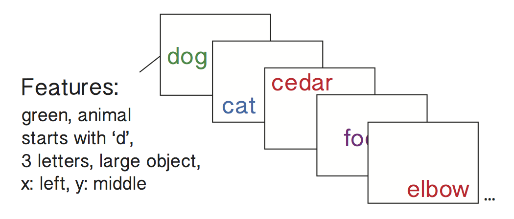

Computing a memory fingerprint
==============================

A memory fingerprint can be defined as a subject's tendency to cluster
their recall responses with respect to more than one stimulus feature
dimensions. What is a "stimulus feature dimension" you ask? It is simply
an attribute of the stimulus, such as its color, category, spatial
location etc. Let's walkthrough an example to gain a better intuition.

Let's imagine you were running a free recall experiment where subjects
were presented with lists of words that varied randomly over a number of
distinct dimensions:

In the figure above, the first word (dog) is: green in color, an animal,
starts with the letter 'd', is large (bigger than a shoebox) and is
positioned left-center on the screen. The next word (cat) is similar
along some dimensions, but different along others. For instance, cat and
dog are both animals, but the words are presented in different colors,
occupy different parts of the computer screen, etc. More generally, each
word on this list is similar to others words along some dimensions, but
different along other dimensions. Let's imagine a subject started
recalling the list as follows:

.. image:: images/fingerprint25.png
    :width: 500pt

In this recall sequence, "dog" was recalled, followed by "cat". For each
recall transition, we can compute the similarity between the two stimuli
along each feature dimension. For example, both words are in the animal
category, so their similarity along that feature dimension would be
high. In the color dimension, green (dog) and blue (cat) are somewhat
similar colors, so these words are somewhat similar along this
dimension. The figure below illustrates how we compute a "clustering
score" for a given recall transition and feature dimension:

.. image:: images/fingerprint3.png
    :width: 500pt

For each recall transition and feature dimension (color in this
example), we:

1. Compute the similarity between the first word of the recall
   transition pair and all other words that the subject could have
   transitioned to
2. Sort these similarity scores from lowest to highest
3. Find the position of the second word of the recall transition pair
4. Divide this by the number of possible transitions to derive a
   "percentile rank"

This analysis is performed to each recall transition and feature
dimension for a given list, and then the percentile ranks are averaged
within feature to get a "memory fingerprint" for each list:

.. image:: images/fingerprint4.png
    :width: 500pt
